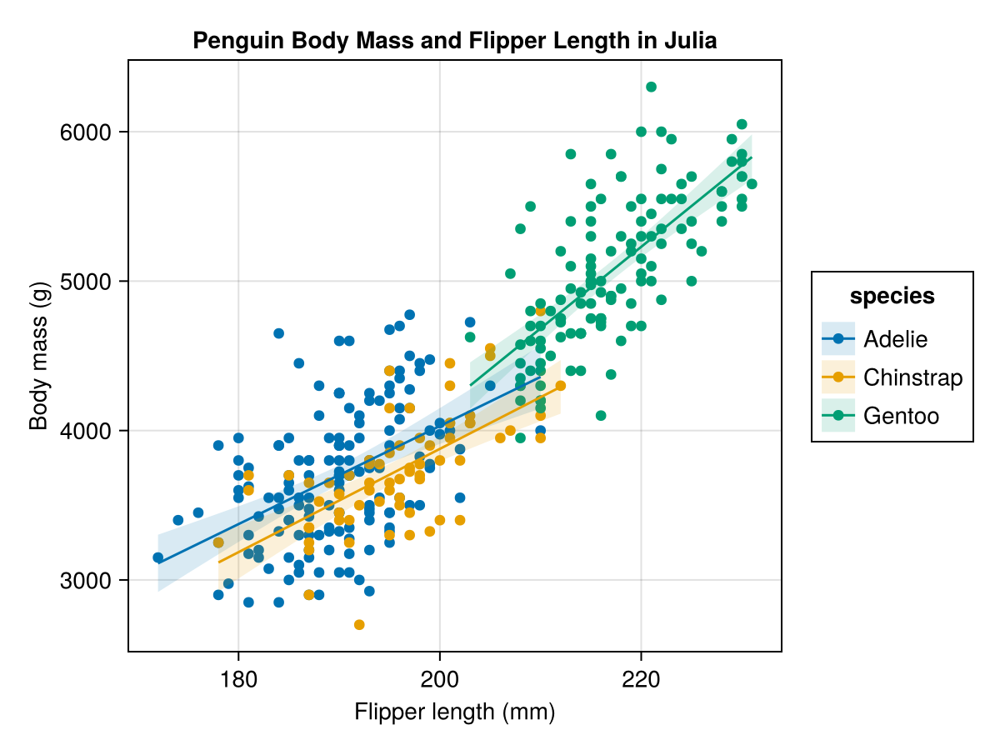

```{r}
#| label: setup-reticulate
#| include: false
matplotlib_cache <- file.path(tempdir(), "matplotlib")
dir.create(matplotlib_cache, showWarnings = FALSE, recursive = TRUE)
Sys.setenv(
  MPLCONFIGDIR = matplotlib_cache,
  MPLBACKEND = "Agg"
)
reticulate::use_python(Sys.which("python3"), required = TRUE)
```

## Today’s goals

By the end of this session, you should be able to:

- Distinguish an **AI source notebook** from a **computational notebook**.
- Use the current name **Gemini Notebook**, formerly NotebookLM.
- Compare Google Colab, Jupyter Notebook, and JupyterLab.
- Explain how Quarto combines computation with reproducible publishing.
- Describe how Quarto works with R, Python, and Julia.
- Explain why Marimo is called a modern reactive Python notebook.
- Choose a notebook environment based on the intended outcome.

## “Notebook” does not mean one thing

| Notebook type | Primary purpose | Example |
|---|---|---|
| Source-grounded AI notebook | Ask questions and create material from selected sources | Gemini Notebook |
| Hosted computational notebook | Run code without local setup | Google Colab |
| Local computational notebook | Explore interactively with a language kernel | Jupyter Notebook / JupyterLab |
| Publishing notebook | Turn code and narrative into durable documents | Quarto |
| Reactive computational notebook | Keep cells and outputs synchronized by dependency | Marimo |

Start by asking: **Do I need to reason from sources, execute code, or publish a reproducible artifact?**

## Google NotebookLM is now Gemini Notebook

Google has renamed **NotebookLM** to **Gemini Notebook**.

- The former address redirects to [notebook.google.com](https://notebook.google.com/).
- The product remains a research and thinking partner grounded in sources you select.
- Google’s help center now uses the name **Gemini Notebook Help**.
- Existing tutorials may still say NotebookLM.

::: {.callout-tip}
When teaching or searching for help, use both names for a while: **“Gemini Notebook (formerly NotebookLM).”**
:::

## Gemini Notebook: sources, chat, and studio {.compact}

A Gemini Notebook workflow has three related parts:

1. **Sources:** Add approved documents and other supported material.
2. **Chat:** Ask questions grounded in those sources and follow citations.
3. **Studio:** Transform source material into outputs such as:
   - Slide decks and briefing material
   - Mind maps
   - Audio Overviews
   - Video Overviews

It is designed to help you understand information—not to execute arbitrary R or Python code.

<small>Source: [Gemini Notebook](https://notebook.google.com/) and [Gemini Notebook Help](https://support.google.com/gemininotebook/)</small>

## Gemini Notebook demonstration

Use two or three public, authoritative sources about one topic.

1. Create a notebook and add the sources.
2. Ask: “What claims appear in every source?”
3. Ask for disagreements or missing evidence.
4. Open each citation and inspect the original passage.
5. Generate a mind map or overview.
6. Ask a question the sources do **not** answer.

**Observe:** Does Gemini Notebook acknowledge the source boundary, or does it overreach?

## A source-grounded prompt

> Using only the sources in this notebook, explain the difference between a computational notebook and a reproducible report. Create a comparison table, cite every major claim, identify one disagreement among the sources, and list two questions the sources cannot answer.

Then verify:

- Does every citation open the relevant passage?
- Does the passage support the wording of the claim?
- Are uncertainty and missing evidence represented honestly?
- Did the generated output introduce facts absent from the sources?

## Gemini Notebook is not a statistics engine

Gemini Notebook can help summarize and connect source material, but it does not replace a computational workflow.

- A citation can support a statement; it does not reproduce a calculation.
- Generated slide, audio, or video output can simplify or distort a source.
- Uploaded material must comply with university policy and copyright rules.
- Confidential student or research information requires explicit approval.
- Important claims still need human review against the original sources.

Use R, Python, or Julia when results must be calculated and rerun.

## Anatomy of a computational notebook

A computational notebook usually contains:

- **Markdown cells:** narrative, equations, links, and instructions
- **Code cells:** executable R, Python, Julia, or another language
- **A kernel or engine:** the process that runs the code
- **Outputs:** text, tables, plots, widgets, and errors
- **Metadata:** language, environment, and display settings

The notebook interface and the computation engine are separate ideas. Changing a kernel changes what code can run.

## Jupyter Notebook

[Jupyter Notebook](https://jupyter-notebook.readthedocs.io/en/stable/) is a lightweight application for authoring computational notebooks.

- Combines code, prose, equations, visualizations, and controls
- Uses kernels for Python, R, Julia, and other languages
- Stores notebooks as `.ipynb` files
- Supports rapid exploration and explanation
- Makes cell-by-cell execution easy

Jupyter Notebook 7 provides a simpler notebook-focused experience than the larger JupyterLab workspace.

## The hidden-state problem

A traditional notebook kernel remembers what has already run.

```text
Cell 1: rate = 0.05       # run first
Cell 2: result = rate * 100
Cell 1: rate = 0.10       # edited but not rerun
Cell 2 output: 5.0        # now stale
```

The visible code and displayed output can disagree.

**Recovery check:** restart the kernel and run all cells from top to bottom. If the notebook fails or changes, it was not fully reproducible.

## JupyterLab

[JupyterLab](https://jupyterlab.readthedocs.io/en/stable/) is a feature-rich, extensible environment built around Jupyter.

It can place several tools in one browser workspace:

- Notebooks and text editors
- Files and terminals
- Code consoles and multiple kernels
- Debugger and table of contents
- Extensions and real-time collaboration
- Remote Jupyter servers and JupyterHub

Choose JupyterLab when one notebook page is not enough for the project.

## Jupyter Notebook or JupyterLab?

| Choose | When you want... |
|---|---|
| **Jupyter Notebook** | A focused, lightweight notebook-authoring interface |
| **JupyterLab** | Notebooks, scripts, terminals, files, and consoles in one workspace |

Both use the same notebook standards and kernel architecture. The difference is primarily the surrounding workspace.

::: {.callout-note}
A `.ipynb` file can contain executable code and rich output. Review unfamiliar notebooks before running them.
:::

## Google Colab

[Google Colab](https://developers.google.com/colab) is a hosted Jupyter Notebook service.

- No local setup for a basic Python workflow
- Preconfigured cloud runtimes
- Access to GPUs and TPUs, subject to availability and limits
- Sharing and collaboration connected to Google services
- Integration with Google Drive
- Gemini assistance for generating, explaining, debugging, and running code

Colab is especially useful for teaching, demonstrations, and temporary compute.

## A practical Colab workflow

1. Open or upload an `.ipynb` notebook.
2. Confirm the active Google account and notebook permissions.
3. Connect to a runtime.
4. Run the environment/setup cells first.
5. Load data from an approved persistent location.
6. Run the notebook from top to bottom.
7. Save the notebook and export any durable artifacts.
8. Disconnect when finished.

A shared notebook does not automatically share its runtime files, installed packages, or active variables.

## Colab constraints

- Free compute is not guaranteed or unlimited.
- Runtime type and availability can change.
- Idle or long-running sessions can disconnect.
- Files stored only in the temporary runtime can disappear.
- Package versions can differ across sessions.
- Cloud execution may be inappropriate for restricted data.

::: {.callout-warning}
A notebook saved in Drive is persistent; the temporary machine running it is not. Save data and results deliberately.
:::

<small>Source: [Colab FAQ](https://research.google.com/colaboratory/faq.html)</small>

## Quarto notebooks

[Quarto](https://quarto.org/) combines plain-text authoring, executable code, and publishing.

A `.qmd` file can contain:

- Markdown narrative and equations
- Executable code cells
- Figures, tables, citations, and cross-references
- Parameters and execution options
- Document metadata in YAML

Quarto can render the same source into HTML, PDF, Word, presentations, dashboards, websites, books, or manuscripts.

## `.qmd` and `.ipynb`

| Dimension | Quarto `.qmd` | Jupyter `.ipynb` |
|---|---|---|
| Storage | Plain-text Markdown | JSON notebook document |
| Git review | Clean line-oriented diffs | Metadata and output can complicate diffs |
| Interactive execution | Through an IDE/editor and engine | Native cell interface |
| Stored output | Usually generated into rendered files | Can be embedded in the notebook |
| Publishing | First-class multi-format system | Often exported or rendered with another tool |

Quarto can also render existing `.ipynb` notebooks, so the formats can work together.

## Quarto with R, Python, or Julia

| Language | Common Quarto execution path |
|---|---|
| **R** | Knitr executes `{r}` cells |
| **Python** | Jupyter executes `{python}` cells |
| **Julia** | Julia engine or an IJulia Jupyter kernel |

A document normally has one primary execution engine. Cross-language work is possible through bridges such as `reticulate`, `PythonCall.jl`, or `RCall.jl`, but separate language-specific notebooks are often simpler.

<small>Sources: [Using R](https://quarto.org/docs/computations/r.html), [Using Python](https://quarto.org/docs/computations/python.html), and [Using Julia](https://quarto.org/docs/computations/julia.html)</small>

## One dataset, multiple languages {.compact}

The next examples load the Palmer Penguins data through language-specific packages:

- **R:** `palmerpenguins::penguins`
- **Python:** `seaborn.load_dataset("penguins")`
- **Julia:** `PalmerPenguins.load()`

Each loader provides observations of Adelie, Chinstrap, and Gentoo penguins from the Palmer Archipelago. The plots use complete values for:

- Flipper length
- Body mass
- Species

## R in this Quarto presentation

```{r}
#| label: penguins-r-plot
#| code-fold: true
#| code-summary: "Show the R code"
#| fig-width: 9
#| fig-height: 4.6
#| fig-align: center
#| out-width: "84%"
#| fig-alt: "Scatterplot of penguin flipper length versus body mass, colored by species, with separate linear trend lines."
library(tidyverse)
library(palmerpenguins)

penguins_r <- penguins |>
  drop_na(flipper_length_mm, body_mass_g, species)

penguins_r |>
  ggplot(aes(
    x = flipper_length_mm,
    y = body_mass_g,
    color = species
  )) +
  geom_point(size = 2.4, alpha = 0.72) +
  geom_smooth(method = "lm", se = FALSE, linewidth = 0.8) +
  scale_color_brewer(palette = "Dark2") +
  labs(
    title = "Penguin Body Mass and Flipper Length in R",
    x = "Flipper length (mm)",
    y = "Body mass (g)",
    color = "Species"
  ) +
  theme_minimal(base_size = 15) +
  theme(legend.position = "bottom")
```

## Python in this Quarto presentation

```{python}
#| label: penguins-python-plot
#| code-fold: true
#| code-summary: "Show the Python code"
#| fig-width: 9
#| fig-height: 4.6
#| fig-align: center
#| out-width: "84%"
#| fig-alt: "Scatterplot made with Python of penguin flipper length versus body mass, colored by species, with separate linear trend lines."
import numpy as np
import matplotlib.pyplot as plt
import seaborn as sns

# Downloads once and then uses Seaborn's local data cache.
penguins_python = sns.load_dataset("penguins").dropna(
    subset=["flipper_length_mm", "body_mass_g", "species"]
)
colors = {
    "Adelie": "#1b9e77",
    "Chinstrap": "#d95f02",
    "Gentoo": "#7570b3",
}

fig, ax = plt.subplots(figsize=(9, 4.6))
for species, group in penguins_python.groupby("species"):
    _ = ax.scatter(
        group["flipper_length_mm"],
        group["body_mass_g"],
        label=species,
        color=colors[species],
        alpha=0.72,
    )
    slope, intercept = np.polyfit(
        group["flipper_length_mm"],
        group["body_mass_g"],
        deg=1,
    )
    x_line = np.linspace(
        group["flipper_length_mm"].min(),
        group["flipper_length_mm"].max(),
        50,
    )
    _ = ax.plot(
        x_line,
        slope * x_line + intercept,
        color=colors[species],
    )

_ = ax.set_title(
    "Penguin Body Mass and Flipper Length in Python",
    fontweight="bold",
)
_ = ax.set_xlabel("Flipper length (mm)")
_ = ax.set_ylabel("Body mass (g)")
_ = ax.legend(title="Species", loc="upper left")
_ = ax.grid(alpha=0.2)
_ = ax.spines[["top", "right"]].set_visible(False)
_ = fig.tight_layout()
plt.show()
```

```{r}
#| label: generate-julia-penguins
#| include: false
julia_log <- system2(
  Sys.which("julia"),
  "penguins_plot.jl",
  stdout = TRUE,
  stderr = TRUE
)
julia_status <- attr(julia_log, "status")
if (is.null(julia_status)) julia_status <- 0L
if (julia_status != 0L) {
  stop(paste(julia_log, collapse = "\n"))
}
stopifnot(file.exists("images/julia_penguins.png"))
```

## The equivalent idea in Julia {.compact}

A Julia Quarto notebook can load the packaged data and create the same relationship.

<details class="code-fold">
<summary>Show the Julia code</summary>

```julia
using Pkg
Pkg.add("PalmerPenguins")
using PalmerPenguins

Pkg.add(["DataFrames", "AlgebraOfGraphics", "CairoMakie"])
using DataFrames
using AlgebraOfGraphics, CairoMakie

ENV["DATADEPS_ALWAYS_ACCEPT"] = "true"

penguins_julia = DataFrame(PalmerPenguins.load())
dropmissing!(
  penguins_julia,
  [:flipper_length_mm, :body_mass_g, :species]
)

plot = data(penguins_julia) *
  mapping(
    :flipper_length_mm,
    :body_mass_g,
    color = :species
  ) *
  (visual(Scatter) + linear())

figure = draw(plot; axis = (
  title = "Penguin Body Mass and Flipper Length in Julia",
  xlabel = "Flipper length (mm)",
  ylabel = "Body mass (g)"
))

output_dir = joinpath(@__DIR__, "images")
mkpath(output_dir)
save(joinpath(output_dir, "julia_penguins.png"), figure)
```

</details>

{.julia-plot fig-alt="Scatterplot made with Julia of penguin flipper length versus body mass, colored by species, with separate linear trend lines." width="72%"}

## Behind today’s deck

This presentation is itself a reproducible Quarto artifact:

- The source is a plain-text `.qmd` file.
- Knitr executes the R cells.
- `reticulate` connects the Python cells to Python 3.
- R and Python load comparable copies of the Palmer Penguins data.
- Quarto renders reveal.js slides.
- `embed-resources: true` creates a self-contained HTML file.

A successful render is a useful test: the document can run from a clean start in the configured environment.

## Reproducibility needs more than a notebook

Record the full computational context:

:::: {.columns}
::: {.column width="50%"}
- Input data and provenance
- Package and language versions
- Random seeds when randomness is used
- Environment or lock files
- Relative project paths
:::

::: {.column width="50%"}
- Execution order
- External services and model versions
- Render command and output format
- Date of data retrieval
:::
::::

A notebook is reproducible only if another person can reconstruct what produced the result.

## Marimo: a modern Python notebook

[Marimo](https://docs.marimo.io/) is an open-source **reactive Python notebook**.

- Running a cell updates dependent cells—or marks them stale in lazy mode.
- Notebooks are stored as ordinary `.py` files.
- Execution order follows variable dependencies rather than page position.
- Deleting a cell removes its variables from program memory.
- Notebooks can run as scripts and deploy as applications.

Marimo was designed to reduce hidden state and stale-output problems common in traditional notebooks.

## Reactive execution

Marimo statically analyzes which variables each cell defines and uses.

```text
Cell A: sample-size slider
          │
          ▼
Cell B: generate sample
          │
          ▼
Cell C: summarize and plot
```

Changing the slider causes dependent cells to update automatically. The dependency graph—not the visual cell order—determines execution order.

::: {.callout-note}
Marimo tracks variable dependencies, not arbitrary mutation inside Python objects. Prefer creating new values instead of mutating shared objects across cells.
:::

## Why Marimo is modern {.compact}

- **Reactive:** dependent cells update or become visibly stale.
- **Deterministic:** dependency-aware execution reduces hidden state.
- **Git-friendly:** notebooks are pure Python files.
- **Interactive:** sliders, tables, plots, and forms work without manual callbacks.
- **Data-oriented:** native SQL and interactive dataframe tools.
- **Environment-aware:** built-in package management and notebook sandboxes.
- **AI-native:** built-in AI features and support for coding agents.
- **Executable:** run notebooks as Python scripts with command-line parameters.
- **Deployable:** publish apps, slides, static HTML, or browser-based WebAssembly.
- **Testable and reusable:** import notebook functions and run `pytest`.

## A reactive Marimo example

In one Marimo cell:

```python
import marimo as mo
import numpy as np

sample_size = mo.ui.slider(
    start=10,
    stop=500,
    value=50,
    label="Sample size"
)
sample_size
```

In a dependent cell:

```python
rng = np.random.default_rng(310)
sample = rng.normal(size=sample_size.value)
mo.md(f"Sample mean: **{sample.mean():.3f}**")
```

Moving the slider reruns the dependent cell—no callback function is required.

## Create, run, and share Marimo

```bash
# Install and open a tutorial
python -m pip install marimo
marimo tutorial intro

# Create or edit a pure-Python notebook
marimo edit analysis.py

# Run it as an application
marimo run analysis.py

# Export a browser-based WebAssembly app
marimo export html-wasm analysis.py -o analysis
```

Package sandboxes can store requirements inside a notebook file; project environments can instead use tools such as `uv` or Pixi.

## Jupyter, Quarto, or Marimo?

| Choose | When the main need is... |
|---|---|
| **Jupyter** | Broad kernel ecosystem and familiar cell-by-cell exploration |
| **Quarto** | Reproducible communication in many publication formats |
| **Marimo** | Reactive Python, clean Git history, interactive apps, and reduced hidden state |

These are not mutually exclusive. Quarto can render Jupyter notebooks, and analysis developed interactively can become a Quarto report.

## Tool-selection guide {.compact}

:::: {.columns}
::: {.column width="58%"}
- **Reason from selected sources:** Gemini Notebook
- **Teach Python with no installation:** Google Colab
- **Use a lightweight local notebook:** Jupyter Notebook
- **Manage notebooks, terminals, files, and kernels:** JupyterLab
- **Publish R, Python, or Julia analysis:** Quarto
- **Build a reactive Python notebook or app:** Marimo
:::

::: {.column width="42%"}
Also ask:

- Where does computation run?
- Where are files stored?
- Can it run from a clean start?
- What data may leave the institution?
- What artifact must the audience receive?
:::
::::

## Mini-activity: match the notebook to the task

Choose a tool and defend the choice:

1. A literature seminar asks questions across six assigned PDFs.
2. A class needs a shared Python notebook with no installation.
3. A researcher works with several kernels, terminals, and remote servers.
4. An analyst must publish one source as HTML, PDF, and Word.
5. A Python dashboard should update immediately when a slider changes.
6. A team wants notebook changes to produce readable Git diffs.

More than one answer may be reasonable. Name the tradeoff.

## Privacy, security, and responsible use {.compact}

- Use only data approved for the selected cloud or AI service.
- Remove student identifiers and protected research information unless explicitly authorized.
- Treat downloaded notebooks and package-install commands as executable software.
- Inspect AI-generated code before running it.
- Verify citations against the original Gemini Notebook sources.
- Save cloud-runtime files to an approved persistent location.
- Record package, language, model, and data versions.
- Restart and run all computational notebooks before sharing.
- Share rendered output when recipients should read results but not execute code.

Convenience does not override university policy or research obligations.

## Key takeaways {.compact}

- **Gemini Notebook** is the new name for NotebookLM and remains source-grounded.
- Gemini Notebook reasons from sources; computational notebooks execute code.
- Colab provides hosted Jupyter notebooks with convenient but non-guaranteed compute.
- Jupyter Notebook is focused; JupyterLab provides a larger workspace.
- Quarto turns code and narrative into reproducible, multi-format publications.
- Quarto supports R, Python, and Julia through appropriate execution engines.
- Marimo adds reactive execution, pure-Python storage, interactivity, and app deployment.
- No notebook replaces verification, environment management, or responsible data handling.

## References {.smaller}

All links were accessed October 3, 2026.

- Google: [Gemini Notebook](https://notebook.google.com/), [Gemini Notebook Help](https://support.google.com/gemininotebook/), [Google Colab](https://developers.google.com/colab), and [Colab FAQ](https://research.google.com/colaboratory/faq.html)
- Project Jupyter: [Jupyter Notebook Documentation](https://jupyter-notebook.readthedocs.io/en/stable/) and [JupyterLab Documentation](https://jupyterlab.readthedocs.io/en/stable/)
- Quarto: [Guide](https://quarto.org/docs/guide/), [Using R](https://quarto.org/docs/computations/r.html), [Using Python](https://quarto.org/docs/computations/python.html), [Using Julia](https://quarto.org/docs/computations/julia.html), and [JupyterLab Workflow](https://quarto.org/docs/tools/jupyter-lab.html)
- Marimo: [Documentation](https://docs.marimo.io/), [Reactive Execution](https://docs.marimo.io/guides/reactivity/), [Package Management](https://docs.marimo.io/guides/package_management/), and [Run Notebooks as Apps](https://docs.marimo.io/guides/apps/)
- Data: Horst, Hill, and Gorman, [`palmerpenguins`](https://allisonhorst.github.io/palmerpenguins/)

Product names, features, AI models, licensing, usage limits, and institutional availability can change. Verify current documentation before teaching or adoption.

## Questions & discussion

::: {.callout-note}
### Join the Discussion
**Date:** December 3, 2026  
**Time:** 12:15–1:15 PM  
**Zoom:** <https://csueb.zoom.us/j/88674490934>
:::

- Which notebook best fits your current work?
- What would make that work reproducible for someone else?
